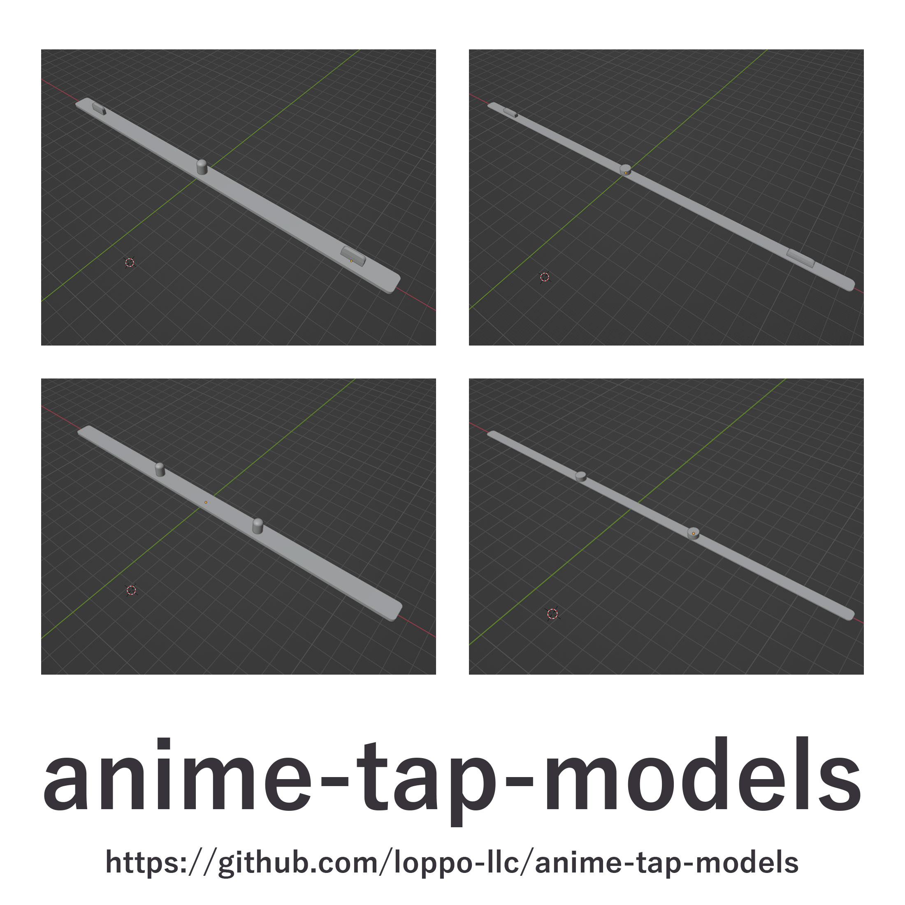

日本語の文章は下にあります。

# anime-tap-models

Animation pegbar model data that can be created with a 3D printer.

## Model List

All models require a 3D printer with a fairly large build volume as they have a long side of 250mm.

- [animetap-3-normal.stl](animetap-2-normal.stl)
- [animetap-3-slim.stl](animetap-2-normal.stl)
- [animetap-2-normal.stl](animetap-2-normal.stl)
- [animetap-2-slim.stl](animetap-2-slim.stl)

## LICENSE

The model data and other elements included in this project are licensed under CERN-OHL-P v2.

You can redistribute, modify, and create products using this document under the conditions of CERN-OHL-P v2 (https:/cern.ch/cern-ohl). This document is distributed without any warranty, whether express or implied, including warranties of merchantability, satisfactory quality, fitness for a particular purpose, etc. For applicable conditions, please refer to CERN-OHL-P v2.

For more details, please see the [LICENSE.md](LICENSE.md) file.

===

3Dプリンターで作成可能な、アニメタップのモデルデータ

## モデルの一覧

いずれのモデルも、長辺250mmのため、比較的大きなビルドボリュームを持つ3Dプリンターが必要です。

- [animetap-3-normal.stl](animetap-2-normal.stl)
- [animetap-3-slim.stl](animetap-2-normal.stl)
- [animetap-2-normal.stl](animetap-2-normal.stl)
- [animetap-2-slim.stl](animetap-2-slim.stl)

## ライセンス

このプロジェクトに含まれるモデルデータ等は、CERN-OHL-P v2 の下でライセンスされています。

あなたは、CERN-OHL-P v2 (https:/cern.ch/cern-ohl)の条件の下で、このドキュメントを再配布し、変更し、それを使用して製品を作成することができます。
このドキュメントは、商品適格性、満足すべき品質、特定目的への適合性など、明示または黙示を問わず、いかなる保証もなく配布されています。適用される条件については、CERN-OHL-P v2を参照してください。

詳細は [LICENSE.md](LICENSE.md) ファイルをご覧ください。
